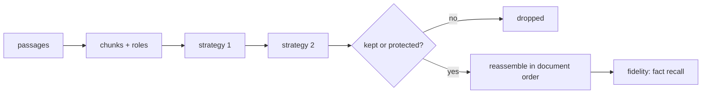

# context-compress — fit more signal into fewer tokens, and measure what you broke

[](https://github.com/darrshangovender/context-compress/actions/workflows/tests.yml)
[](LICENSE)
[](https://python.org)
[](pyproject.toml)

> Prompt and RAG context compression with a fidelity evaluator attached. Five strategies, a composable pipeline, and a fact-recall number reported alongside token savings — because a compressor that halves your tokens and loses the answer is not a saving, it's an outage.

**Why this exists.** Long contexts are the largest controllable line item in an LLM bill, and retrieved RAG context is mostly padding — overlapping chunks, near-duplicates, and framing prose around one or two load-bearing sentences. Everyone truncates. Almost nobody measures what truncation destroyed.

**One of four on inference economics:** [cascade](https://github.com/darrshangovender/cascade) (route to the cheapest model) · [thinking-loop](https://github.com/darrshangovender/thinking-loop) (spend more when it's hard) · `context-compress` (shrink the input) · [guardrail](https://github.com/darrshangovender/guardrail) (validate both ends).

---

## The result

60 synthetic RAG scenarios, 120-token budget, seed 42, fully offline (`python benchmarks/run.py` — no API keys, no model downloads, no results file committed):

| strategy | mean tokens | saved | **fact recall** |
|---|---:|---:|---:|
| no compression | 186.4 | 0% | 100.0% |
| truncate | 79.8 | **57%** | 21.7% |
| truncate + tail | 99.3 | 45% | 10.0% |
| top-k | 113.1 | 38% | 100.0% |
| sentence-prune (min=1) | 118.3 | 35% | 48.3% |
| sentence-prune (min=0) | 115.3 | 37% | 95.0% |
| **summarize** | **96.1** | **48%** | **100.0%** |
| dedupe → top-k | 111.5 | 39% | 100.0% |
| dedupe → sentence | 115.9 | 36% | 100.0% |

**Read the last column first.** Truncation is the biggest saver and the worst compressor — it destroys most of the answers. `summarize` gets 48% fewer tokens at full recall on this set. That gap is the entire argument for the library: savings without a fidelity number is a metric you cannot act on.

**Read the fidelity caveat second.** These recall figures are an upper bound, not a measurement of answer survivability — see the first two entries under Limitations before quoting them anywhere.

`SentencePruneStrategy(min_sentences=1)`, the intuitive default, scores far worse than its `min_sentences=0` sibling: pinning the lead sentence of every chunk spends the budget on framing prose before the scorer reaches the sentence holding the answer. Both variants stay in the benchmark so the cost of the wrong default is visible rather than buried. **Use `min_sentences=0` for retrieved passages.**

## Quick start

```bash
pip install -e ".[dev]"      # zero runtime dependencies
python benchmarks/run.py
```

```python
from context_compress import Compressor, FidelityEvaluator
from context_compress.strategies import DedupeStrategy, SummarizeStrategy

chunks = Compressor.chunks_from_passages(retrieved_passages)

result = Compressor(
    [DedupeStrategy(), SummarizeStrategy()],   # dedupe first, then condense
    budget=2000,
).compress(user_query, chunks)

print(result.text)                             # compressed context, in document order
print(f"{result.saved_pct:.0%} fewer tokens")

report = FidelityEvaluator().evaluate(result, required_facts=["p99 fell to 45ms"])
print(f"recall {report.recall:.0%}, missing: {report.missing}")
```

## How it works



1. Build a `Chunk` list, tagging each with a `Role` — `SYSTEM`, `INSTRUCTION` and `QUERY` are protected; `CONTEXT` and `HISTORY` are compressible.
2. `Compressor.compress(query, chunks)` counts the original token cost.
3. Each strategy runs in order. Before scoring, it subtracts the protected chunks' cost from the budget and raises `BudgetTooSmall` if protected content alone doesn't fit.
4. The strategy scores compressible chunks — `HybridScorer` is 0.8 BM25 plus 0.2 U-shaped position — and sets `kept`, `score`, and possibly a rewritten `text`.
5. Survivors feed the next stage; dropped chunks stay dropped.
6. The result reassembles kept chunks **sorted by original position**, not by rank.
7. `FidelityEvaluator` checks the compressed text against the facts the answer requires.

## The five strategies

| Strategy | Granularity | What it does | Best for |
|---|---|---|---|
| `TruncateStrategy` | chunk | Fill from head, optionally reserving a tail budget | The baseline to beat; conversation history |
| `TopKStrategy` | chunk | Score against the query, greedily keep the best | General RAG; the safe default |
| `SentencePruneStrategy` | **sentence** | Keep the highest-value sentences *within* chunks | Verbose passages where signal is 10–20% of text |
| `DedupeStrategy` | chunk | Drop near-duplicates by Jaccard over 3-gram shingles | Sliding-window retrieval — compose this first |
| `SummarizeStrategy` | tiered | Keep / condense / drop by relevance band | The best all-rounder on the benchmark |

Order is load-bearing. Dedupe first so the selector never spends budget ranking three copies of the same passage; reversed, you pay to rank redundancy.

## Design decisions

| Decision | Why |
|---|---|
| **Zero runtime dependencies** | Installs and runs anywhere, including offline CI. `tiktoken` is an optional extra for exact counts. |
| **BM25, not raw TF-IDF** | Term saturation matters: a chunk repeating a query term 20× isn't 20× more relevant. Without it, keyword-stuffed boilerplate beats the passage that answers the question. |
| **Extractive, never abstractive** | An LLM-written summary costs a call per chunk and introduces a hallucination surface *inside your context* — the one place ground truth must stay intact. |
| **Position scoring is U-shaped** | Models recall the head and tail of long contexts far better than the middle (Liu et al., 2023), so dropping from the weak middle costs least. |
| **Kept chunks re-emitted in document order** | Reordering context to match relevance rank hurts multi-hop questions where narrative sequence carries meaning. |
| **Protected roles are never touched** | Dropping an instruction to save tokens silently changes the task rather than the evidence — the worst failure mode a compressor has, and easy to ship by accident. |

## Limitations

- **Fuzzy fidelity is a bag-of-words check, and it inflates the headline recall column.** A fact counts as present if every word longer than two characters appears *anywhere* in the compressed text — order-independent, across chunk boundaries. `"p99 fell to 45ms"` scores as found when `p99`, `fell` and `45ms` survive in three unrelated passages. `fuzzy=True` is the default and the benchmark uses it. The 100% rows are an upper bound on answer survivability, not a measurement of it.
- **The benchmark's required fact is verbatim the second sentence of the signal passage**, and there is exactly one fact per item — so per-item recall is binary and the aggregate is a survival rate over 60 coin flips. It measures "did that sentence live", not "can the context answer the query".
- **All token counts in the benchmark are heuristic.** `tiktoken` is an opt-in extra and CI installs `[dev]` only, so the mean-token column is produced by a chars-per-token constant, and the 120-token budget is enforced in those same heuristic units.
- **Chunks are mutated in place, so a chunk list is single-use.** Strategies write `kept`, `score` and `text` onto the caller's objects. Re-running any compressor over the same list operates on already-truncated text. There is no copy, no reset, and nothing in the API signals it.
- **`min_sentences` is documented as a guarantee but is only a sort key.** Pinned sentences are given infinite score, then still budget-checked. If the pinned leads alone exceed the remaining budget, later pins are silently dropped and the contract breaks with no error.
- **Dedupe is O(n²) exact Jaccard, not MinHash** despite what the module docstring says. There is no signature, no banding, no LSH. At k=100 retrieved passages that is thousands of full set intersections per query.
- **Sentence splitting assumes capitalised English.** A sentence starting lowercase, a bullet list, or any non-Latin script collapses a passage into one unsplittable unit — silently disabling both `SentencePruneStrategy` and `SummarizeStrategy`'s condense path.
- **When no query term matches any chunk, the pipeline silently degrades to head truncation** while still labelling the result `topk`. BM25 normalisation returns all zeros, the min-score filter drops nothing, and the budget fills in original order.

## Project layout

```
context-compress/
├── context_compress/
│   ├── types.py        # Chunk · Role · CompressionResult · FidelityReport
│   ├── tokenizer.py    # tiktoken-optional counting + sentence splitting
│   ├── scoring.py      # BM25 lexical · U-shaped position · hybrid
│   ├── fidelity.py     # fact-recall evaluator
│   ├── compressor.py   # the composable pipeline
│   └── strategies/     # truncate · topk · sentence · dedupe · summarize
├── benchmarks/         # reproducible offline benchmark + synthetic RAG set
├── examples/           # rag_pipeline.py
├── tests/              # 69 tests, all offline
└── docs/strategies.md
```

## Tests

```bash
pytest tests/ -q          # 69 tests, no API keys, no network
python benchmarks/run.py
```

Both invariants — protected roles untouched, budget never exceeded — are enforced by parametrised tests across all five strategies. CI runs the suite and the benchmark on every push.

## Author

Darrshan Govender · [Agulhas Code](https://agulhascode.co.za) · Durban, South Africa
